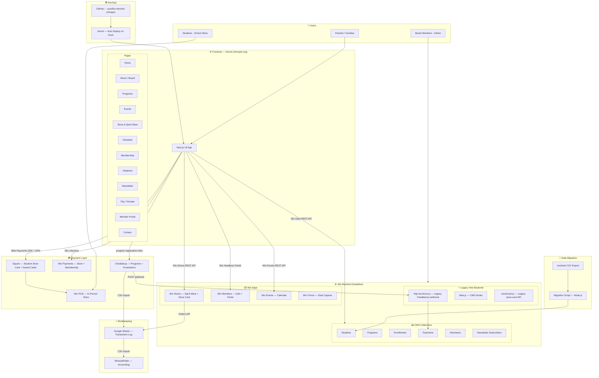
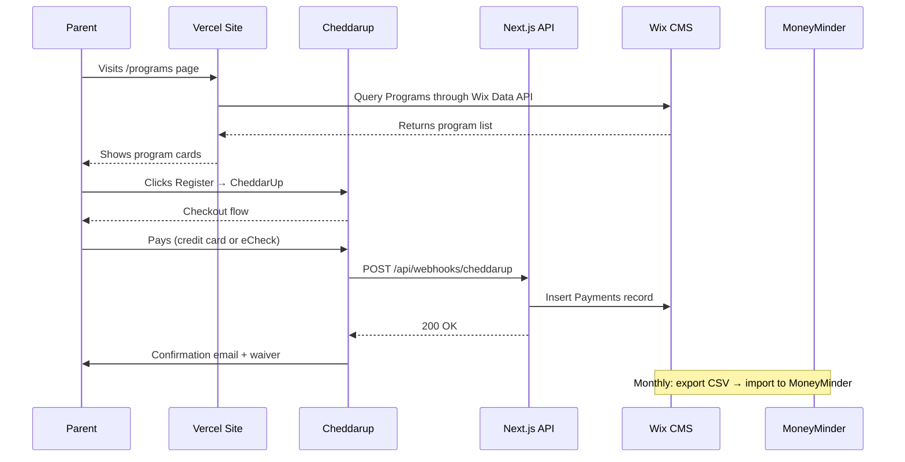
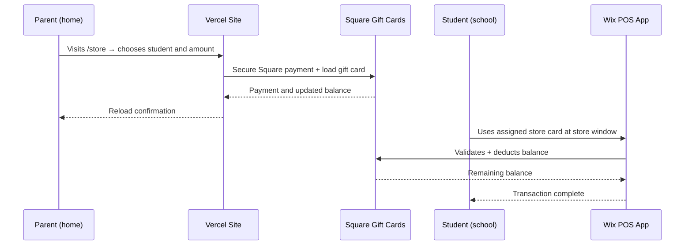
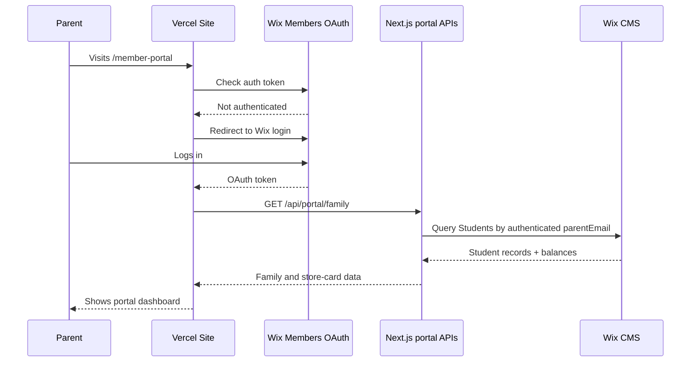

# SHMS PTO Platform Architecture
**Stone Hill Middle School PTO — Technical Architecture Document**
Last updated: June 2026

---

## Overview

The SHMS PTO platform uses a **headless architecture** — Wix powers all backend data and business logic, while a Next.js frontend hosted on Vercel delivers the public-facing website. Parents and students interact with the Vercel site; all data lives in Wix.

---

## System Architecture Diagram



---

## Data Flow Diagrams

### 1. Parent Pays for Enrichment Program



### 2. Student Uses School Store Card



### 3. Member Portal — View Student Balance



---

## Technology Stack

| Layer | Technology | Purpose |
|---|---|---|
| **Frontend** | Next.js 16, React, Tailwind CSS, shadcn/ui | Public website |
| **Hosting** | Vercel | Frontend deployment, auto-deploy from GitHub |
| **Backend Data** | Wix CMS (headless) | Students, Programs, Enrollments, Payments, Volunteers, Newsletter |
| **Store** | Wix Stores V3 | Spirit wear, schwag, memberships, store cards |
| **Payments — Online** | Wix Payments + Cheddarup | Store checkout + enrichment programs/fundraisers |
| **Payments — In-Person** | Wix POS + Tap to Pay | School store window (volunteer's iPhone) |
| **Gift Cards** | Square Gift Cards + Web Payments SDK | Student store card, secure reloads, saved cards, and auto top-off |
| **Auth** | Wix Members (headless OAuth) | Parent login, member portal |
| **Events** | Wix Events | PTO meetings, dance night, NOVA Math |
| **Code** | Next.js API routes + limited legacy Velo | Canonical webhooks and portal APIs; Wix CMS hooks remain in Velo |
| **Version Control** | GitHub (auraflux-dev/wix-shmspto) | All code, auto-syncs to Wix Studio + Vercel |
| **Bookkeeping** | MoneyMinder + Google Sheets | Financial tracking, CSV import from Cheddarup/Wix |
| **Enrichment Payments** | Cheddarup Team | Programs, waivers, installments, peer-to-peer fundraising |
| **Migration** | Node.js script | Jumbula CSV → Wix Students CMS |

---

## Repository Structure

```
auraflux-dev/wix-shmspto/
├── frontend/                    # Next.js app (deploys to Vercel)
│   ├── app/
│   │   ├── page.tsx             # Homepage
│   │   └── layout.tsx           # Root layout
│   ├── components/
│   │   ├── announcement-bar.tsx
│   │   ├── navbar.tsx
│   │   ├── hero.tsx
│   │   ├── programs-preview.tsx
│   │   ├── volunteer-section.tsx
│   │   ├── upcoming-events.tsx
│   │   ├── community-banner.tsx
│   │   ├── footer.tsx
│   │   └── ui/                  # shadcn/ui components
│   └── lib/
│       └── utils.ts
├── src/                         # Wix Velo code (syncs to Wix Studio)
│   ├── pages/
│   │   ├── masterPage.js        # Nav, footer, member welcome — all pages
│   │   ├── Home.c1dmp.js        # Homepage logic
│   │   ├── About.se3l5.js       # Board members
│   │   ├── Programs.m4kt5.js    # CMS-driven programs
│   │   ├── Volunteer.js         # Form → CMS
│   │   ├── Membership.js        # → Cheddarup
│   │   ├── Contact.js           # Form → CMS
│   │   ├── Initiatives.js       # Harris Teeter, NOVA Math
│   │   ├── Newsletter.js        # Subscribe → CMS
│   │   └── MemberPortal.js      # Gated portal
│   └── backend/
│       ├── http-functions.js    # Cheddarup webhook, store card API
│       └── data.js              # CMS validation hooks
├── migration/
│   ├── import-to-wix.js         # Jumbula → Wix CMS
│   └── map-schema.js            # Field mapping config
└── docs/
    └── ARCHITECTURE.md          # This file
```

---

## CMS Collections Schema

### Students
Stores parent/student data migrated from Jumbula.
| Field | Type | Notes |
|---|---|---|
| firstName, lastName | TEXT | Student name |
| grade | TEXT | 6, 7, or 8 |
| parentEmail | TEXT | Primary key for lookups |
| parentFirstName, parentLastName | TEXT | |
| parentPhone | TEXT | |
| emergencyContact, emergencyPhone | TEXT | |
| allergies | TEXT | Medical notes |
| storeCardCode | TEXT | Gift card code |
| storeCardBalance | NUMBER | Current balance |
| membershipStatus | TEXT | none / active / expired |
| membershipTier | TEXT | ruby / supreme |
| jumbulaSid | TEXT | Original Jumbula ID |

### Programs
Enrichment programs catalog.
| Field | Type | Notes |
|---|---|---|
| name | TEXT | Program name |
| description | RICH_TEXT | |
| fee | NUMBER | Cost in USD |
| capacity | NUMBER | Max enrollment |
| registrationOpen | BOOLEAN | Shows Register button |
| cheddarupUrl | URL | Links to Cheddarup collection |
| requiresWaiver | BOOLEAN | |
| grades | TEXT | e.g. "6,7,8" or "6-8" |

### Payments
All payment records from Cheddarup and Wix.
| Field | Type | Notes |
|---|---|---|
| payerEmail, payerName | TEXT | |
| amount | NUMBER | |
| source | TEXT | cheddarup / wix_store / wix_pos |
| transactionId | TEXT | External ID |
| syncedToMoneyMinder | BOOLEAN | Reconciliation flag |
| giftCardCode | TEXT | If store card payment |
| wixOrderId | TEXT | If Wix store order |

---

## Environment Variables (Vercel)

```env
# Wix API — production headless site (CMS / Stores / Events)
WIX_SITE_ID=509fda24-8dbf-43c6-aa74-df9f8b63c388
WIX_API_KEY=your_wix_api_key
NEXT_PUBLIC_WIX_CLIENT_ID=your_oauth_client_id

# Public site (update to https://www.shmspto.org after DNS cutover)
NEXT_PUBLIC_SITE_URL=https://www.shmspto.org

# Cheddarup
CHEDDARUP_WEBHOOK_SECRET=your_secret

# Square gift cards (use production before go-live)
SQUARE_ACCESS_TOKEN=
SQUARE_ENVIRONMENT=production
SQUARE_LOCATION_ID=
SQUARE_WEBHOOK_SIGNATURE_KEY=
SQUARE_NOTIFICATION_URL=https://www.shmspto.org/api/webhooks/square
```

> `wix.config.json` and the headless configuration both use site
> `509fda24-8dbf-43c6-aa74-df9f8b63c388`.

---

## Open Items / Next Steps

### Done in code (as of Jul 2026)
- [x] Wix Headless OAuth member portal flow (needs production redirect URI + SITE_URL)
- [x] Wix Stores API → store + spirit wear catalog
- [x] Wix Events API → events pages
- [x] Public pages implemented in Next.js (`frontend/`)
- [x] Membership Join → Wix product pages; store-card links use Wix storefront until DNS
- [x] Fundraising membership product IDs wired

### Still open (ops / content)
- [ ] Register OAuth redirect `https://www.shmspto.org/auth/callback` (+ current Vercel URL) in Wix OAuth client
- [~] `shmspto.org` / `www` are attached to Vercel; DNS still points to Wix
- [~] Square production env names are present; webhook configuration and signed-in E2E remain
- [ ] Point Cheddarup webhook at `https://www.shmspto.org/api/webhooks/cheddarup?token=…`
- [ ] Add Cheddarup URLs on Programs CMS rows that should be open
- [ ] Delete Wix demo/duplicate store products
- [ ] Replace Unsplash placeholder images with real SHMS photos
- [ ] Jumbula CSV export → migration scripts
- [ ] Google Sheets transaction log / MoneyMinder
- [ ] Cancel Zapier if still active
- [x] Confirm Git Integration and headless site ID (`509fda24`)