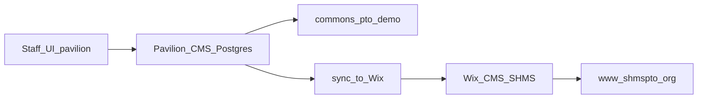

# Pavilion CMS (authoritative)

Audience: product

## Model

| Layer | Role |
|-------|------|
| **Pavilion CMS** (Postgres `cms_*` tables, org-scoped) | Source of truth for content + form queues for demo, trials, and all Pavilion-hosted customers |
| **Staff UI / APIs** | Always author in `~/pavilion`; read/write Pavilion CMS when `DATABASE_URL` + commons platform |
| **SHMS (VIP)** | Still publishes via **Wix** today. After content is correct in Pavilion CMS, **sync/commit those rows into Wix CMS** and promote staff code to `~/shmspto` |



## Tables (v1)

- `cms_site_settings` — key/value
- `cms_page_content` — PageContent-shaped rows
- `cms_nav_links` — NavLinks
- `cms_collection_items` — generic collections (Board, FAQ, …) next
- `cms_form_submissions` — volunteer/contact queues next

Schema: [`frontend/lib/cms/schema-sql.ts`](../frontend/lib/cms/schema-sql.ts)  
Store: [`frontend/lib/cms/store.ts`](../frontend/lib/cms/store.ts)

## SHMS publish path

1. Edit content in Pavilion Staff (demo or a Stone Hill org row in Pavilion CMS).
2. Run sync to Wix (script / Staff action; Wix keys only on shmspto / Doppler `shmspto/prd`):

```bash
# from ~/shmspto with Wix creds — pushes Pavilion CMS export JSON into Wix
bash scripts/doppler_prd.sh node scripts/sync-pavilion-cms-to-wix.mjs --org org_riverside --from-file ./tmp/cms-export.json
```

3. Promote/ship staff code: `node scripts/promote-to-shms.mjs` then `ship-stone-hill.mjs` when product UI changed.

Do **not** treat Wix as the place to author shared product content long-term. Pavilion CMS is authoritative; Wix is the SHMS publish connector until cutover.

## Code defaults

When Pavilion CMS has no row yet, public site still falls back to code defaults / DEMO fixtures / (SHMS) Wix.
